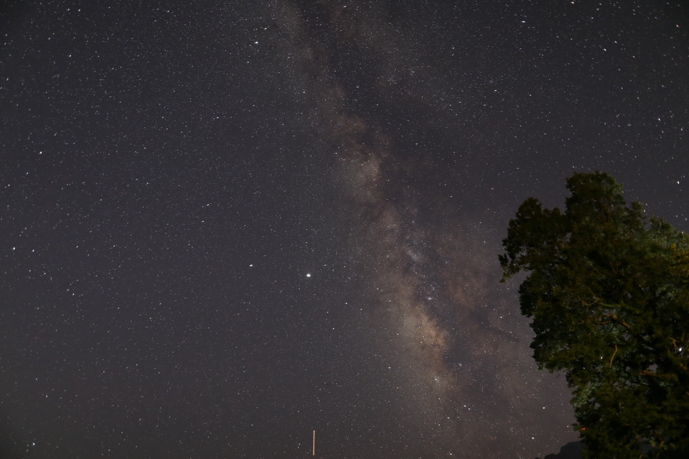
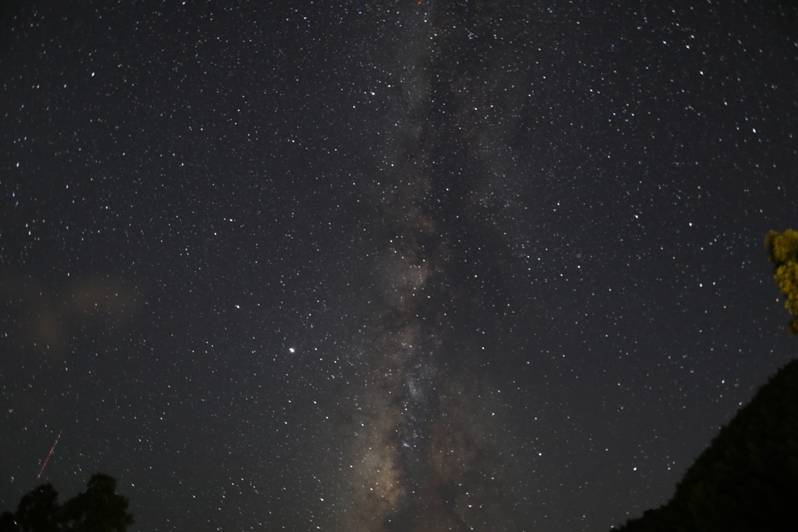
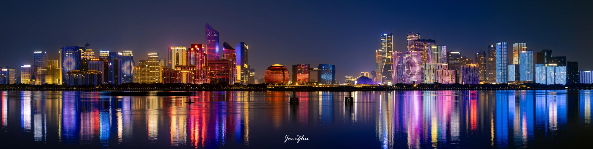

  <picture>
    <source media="(prefers-color-scheme: dark)" srcset="assets/banner-dark.svg">
    
  </picture>

 

I'm **Joe Zhu**, an undergraduate majoring in **Bioinformatics** at the ZJU-UoE Institute, Zhejiang University.
I stay curious about novel things, keep a real passion for life, and carry a camera for the moments worth keeping.

**Homepage** · [www.fantasticjoe.com](https://www.fantasticjoe.com) &nbsp;&nbsp;|&nbsp;&nbsp; **Blog** · [blog.fantasticjoe.com](https://blog.fantasticjoe.com)

 

## Writing

来自博客的最新文字，每日自动更新 · Latest posts, refreshed daily

<!-- BLOG-POST-LIST:START -->- [Bingline API：每天一行新的风景](https://blog.fantasticjoe.com/46894891.html) · May 26, 2026
- [0a.ink：给每个想法一个新行](https://blog.fantasticjoe.com/b3e16d1f.html) · May 25, 2026
- [SciPalette：为科研图表准备的配色工作台](https://blog.fantasticjoe.com/9d4f0b28.html) · May 25, 2026
- [Hortus：一次博客风格迁移](https://blog.fantasticjoe.com/75d3a91c.html) · May 25, 2026
- [分享一下自用的一个分类文献调研Prompt](https://blog.fantasticjoe.com/fc133c35.html) · Mar 23, 2026
<!-- BLOG-POST-LIST:END -->

 

## GitHub

代码的痕迹 · Traces of code

  <picture>
    <source media="(prefers-color-scheme: dark)" srcset="metrics-languages-dark.svg">
    
  </picture>
  <picture>
    <source media="(prefers-color-scheme: dark)" srcset="https://streak-stats.demolab.com?user=fantasticjoe&background=1C1C1C&border=333333&stroke=333333&ring=648679&fire=648679&currStreakNum=E6DED0&sideNums=E6DED0&currStreakLabel=648679&sideLabels=648679&dates=8F8A7E&border_radius=18">
    
  </picture>

<picture>
  <source media="(prefers-color-scheme: dark)" srcset="metrics-isocalendar-dark.svg">
  
</picture>

<picture>
  <source media="(prefers-color-scheme: dark)" srcset="https://raw.githubusercontent.com/fantasticjoe/fantasticjoe/output/snake-dark.svg">
  
</picture>

 

## Photography

相机记下的瞬间 · Moments kept with a camera

  
  

Take in Hangzhou · 杭州

 

  <em>Stay Hungry, Stay Foolish</em>
    
  Hand-drawn SVG assets · palette shared with <a href="https://www.fantasticjoe.com">fantasticjoe.com</a>

